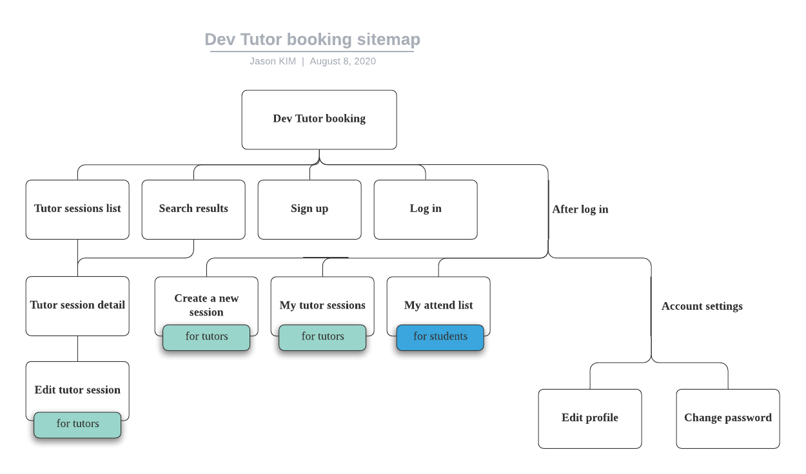

<h1 align="center"> Tutor booking app
</h1>

# Table of Contents

* [A problem that needs solving](#A-problem-that-needs-solving)
* [Deployed app link](#Deployed-app-link)
* [GitHub repository link](#GitHub-repository-link)
* [Description](#Description)
  * [Purpose](#Purpose)
  * [Functionality / features](#Functionality-/-features)
  * [Sitemap](#Sitemap)
  * [Screenshots](#Screenshots)
  * [Target audience](#Target-audience)
  * [Tech stack](#Tech-stack)
* [User stories](#User-stories)
* [Wireframes](#Wireframes)
* [ERD](#ERD)
* [High-level components](#High-level-components)
* [Third party services](#Third-party-services)
* [Models](#Models)
* [Database relations](#Database-relations)
* [Database schema design](#Database-schema-design)
* [Task allocation and tracking](#Task-allocation-and-tracking)
   

# A problem that needs solving
Most of aspiring web/mobile developers have very little chance to present, lecture, or discuss about their own projects to the others whether it is online or offline. Finishing a project by themselves and not sharing anything with other developers will loose a good oppertunity which could have empowered their development and communication skills. Sometimes even learning programming language needs to be get lectured, discussed or helped by others.

[Go back](#table-of-contents)   

# Deployed app link

Deployed app link : https://devtutorbooking.herokuapp.com/

[Go back](#table-of-contents)   

# GitHub repository link

GitHub repository link :  https://github.com/jasonkim7288/rails_tutor_booking

[Go back](#table-of-contents)   

# Description

## Purpose
Tutor Booking app is a development tutor sessions booking app for any web/mobile developer or student to organize a session to have a presentation, give a lecture, or have a discussion with other students about their project or some programming language subject whether it is online or offline. These tutor sessions will make them help each other and become better developers.

[Go back](#table-of-contents)   

## Functionality / features
Tutor Booking app is fully responsive from mobile to desktop and uses Google Maps API so that users can easily check out the place where the session will take place.
### Home page
The first screen when users enter this Tutor Booking App show the motto, "Helping each other will make you great developers", which is the purpose of this app. There is a search field on the navbar which users can search tutor sessions by tutor's name, tutor's details, comments, tutor session's details. In the middle of the page, users can filter the tutor sessions list by their place type and category. At the bottom of this page, there will be 12 recent tuto sessions list.
### Tutor session detail page
On top of the tutor session detail page, there is a category for the current tutor session which is clickable and leads to the related filtered tutor sessions list. Users can check the title, description, the tutor's information, schedule, place or video conference URL, participants, the number of seats remained, etc. They are also able to create, edit, and delete comments on the current tutor session.

### Create/Edit tutor session page
All registered users can make their own tutor sessions and maintain them. The header image is fixed based on the category so that the tutors don't need to put too much time on making their own header image. If the tutor session is going to be online, video conference URL such as Zoom, Skype, Discord can be input. If it is a offline session, there is an easy way to input address where it takes place by autocomplete function and dynamic Google Map. Start and end date is automatically set to 9am to 5pm tomorrow,and easily changable.

### Sign up and Log in page
Simple card style sign up and log in pages make users feel free to join. If a user forgot his or her password, then reset password instruction will be sent through the user's email.

### Filtered and Searched sessions list page
Users can always find their suitable sessions by the search function on the navbar, filter selection on the main pate, or category selection on the tutor session detail page.

### Edit profile page
Once a user signs up, it will lead to the edit profile page. The user have 3 choices to have a profile icon. If the user didn't update his or her name on the edit profile page, the profile icon will refer to the email address and make email's initial-based icon. If the user updated his or her name, it will make name's initial-based icon. If the user uploaded image file, it will refer to the uploaded image. If the user updated his or her 'about me', other users can also search tutor sessions by this information.

[Go back](#table-of-contents)   

## Sitemap

[Go back](#table-of-contents)   

## Screenshots
#### Home

#### Sign up

#### Tutor session detail

#### Edit tutor session

#### Filtered sessions list

#### Edit profile

[Go back](#table-of-contents)   

## Target audience
Tutor Booking app is for any student who wants to be a web/mobile app developer and for any current web/mobile app developer who wants to help students.

[Go back](#table-of-contents)   

## Tech stack
- Ruby on Rails : front end and back end source code
- Heroku : deploy the code
- Google Maps JavaScript API : display dynamic Google map on create, update, and show page of the tutor session
- Google Places API : address autocomplete function on create, update page of the tutor session
- Stimulus js : javascript in Rails to implement Google Maps API
- Stimulus Reflex : reactive web interface for the component-based page update to implement instant create, update, and delete of comments
- Bootstrap : css framework
- AWS S3 bucket : cloud service for the profile image upload
- tempusdominus-bootstrap-4 : dateTime picker package with bootstrap to manage start and end datetime of the tutor session
- Devise : authentication gem
- cancancan : authorization gem. All users including guests can read all the tutor sessons list. Registered users can create, edit, delete their own sessions only. Administrators can manage all the tutor sessions no matter who made them.
- pg_search : PostgreSQL full text search gem to search the tutor sessions by tutor's name, tutor's details, comments, and tutor session's details
- telephone_number : localized phone number verification gem

[Go back](#table-of-contents)   

# User stories
Users can be both students and tutors

## Users (Both students and tutors)
- As a user, I want to sign up and log in, so I can create or attend tutoring sessions.
- As a user, I want to log out, change password, and cancel my account, so I can keep my account secure.
- As a user, I want to see a summary of tutoring information on the list, so I can check which tutoring session suits me or edit my tutoring session.
- As a user, I want to see detailed information about each tutoring session , so I can decide if I am going to attend it, or I can edit the tutoring information if I own it.
- As a user, I want to search for tutoring sessions by keyword, place, or category, so I can filter the tutor session that I would like to attend.
- As a user, I want to comment for each tutoring session, so I can ask or answer some questions about this tutoring session.
## Tutors
- As a tutor, I want to create a tutoring session, so I can organise the tutoring session.
- As a tutor, I want to edit the tutoring session I made, so I can let the students know if there are some changes about the tutoring.
- As a tutor, I want to see all the tutoring sessions I made, so I can keep track of them.
## Students
- As a student, I want to be able to attend each tutor session, so I can participate in this tutor session.
- As a student, I want to see all the tutor sessions that I have decided to attend, so I can check the schedule and cancel the tutor session.

[Go back](#table-of-contents)   

# Wireframes
## for mobile (iPhone 8 plus)

Download <a href="docs/DevTutorBookingApp_Mobile.bmpr"> Balsamiq </a> or <a href="docs/DevTutorBookingApp-Mobile.pdf"> PDF </a> for checking the flow

## for tablet (iPad)

Download <a href="docs/DevTutorBookingApp_Tablet.bmpr"> Balsamiq </a> or <a href="docs/DevTutorBookingApp-Tablet.pdf"> PDF </a> for checking the flow

## for desktop

Download <a href="docs/DevTutorBookingApp_Desktop.bmpr"> Balsamiq </a> or <a href="docs/DevTutorBookingApp-Desktop.pdf"> PDF </a> for checking the flow

[Go back](#table-of-contents)   

# ERD

[Go back](#table-of-contents)   

# High-level components

[Go back](#table-of-contents)   

# Third party services
Tutor Booking app makes use of a variety of third party servies such as Google Maps/Places API, tempusdominus-bootstrap-4, Devise gem, Cancancan gem, and pg_search gem
### Google Maps/Places API
Google Maps/Places API is supported by Google Cloud Platform and useful for typing address and displaying dynamic map image. Most of them are made with Javascript and able to be well implemented with Stimulus JS for Ruby on Rails. Because initialising Google Maps api takes time, there needs to be a callback function connected between turbolink's javascript including code and the actual element of the page. Dynamic map api needs an instance of google.maps.Map class and google.maps.Marker class, and autocomplete api needs google.maps.places.Autocomplete class. Whenever user changed the address by autocomplete, Autocomplete class instance figures out the boundary size and GPS coordinates, so Map and Marker instance need to change their boundary size and GPS coordiates through the source code.
### tempusdominus-bootstrap-4
tempusdominus-bootstrap-4 is a node package that provides pretty date and time picker with Bootstrap css framework. It is made of css and javascript and also needs other packages such as fullcalendar, jquery, moment, and moment-timezone.

### Devise and Cancancan gem
Devise gem is for authentication which takes care of log in, sign up, change password, 

[Go back](#table-of-contents)   

# Models

[Go back](#table-of-contents)   

# Database relations

[Go back](#table-of-contents)   

# Database schema design

[Go back](#table-of-contents)   

# Task allocation and tracking
### Trello web site : https://trello.com/b/uZrLbHs9/dev-tutor-booking-app
### Day 1 planning

### Week 1

### Week 2

### Week 3

[Go back](#table-of-contents)   

