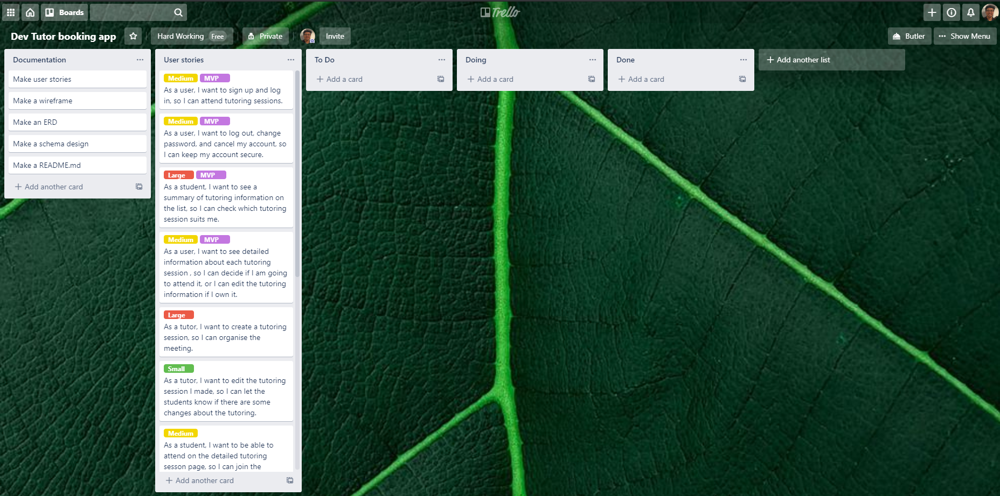

<h1 align="center"> Tutor booking app
</h1>

# Table of Contents

* [A problem that needs solving](#A-problem-that-needs-solving)
* [Deployed app link](#Deployed-app-link)
* [GitHub repository link](#GitHub-repository-link)
* [Description](#Description)
  * [Purpose](#Purpose)
  * [Functionality / features](#Functionality-/-features)
  * [Sitemap](#Sitemap)
  * [Screenshots](#Screenshots)
  * [Target audience](#Target-audience)
  * [Tech stack](#Tech-stack)
* [User stories](#User-stories)
* [Wireframes](#Wireframes)
* [ERD](#ERD)
* [High-level components](#High-level-components)
* [Third party services](#Third-party-services)
* [Models](#Models)
* [Database relations](#Database-relations)
* [Database schema design](#Database-schema-design)
* [Task allocation and tracking](#Task-allocation-and-tracking)
   

# A problem that needs solving
Most aspiring web/mobile developers have very little chance to present, lecture, or discuss their own projects to the others whether it is online or offline. Finishing a project by themselves and not sharing anything with other developers will lose a good opportunity which could have empowered their development and communication skills. Sometimes even learning programming language needs to be get lectured, discussed, or helped by others.

[Go back](#table-of-contents)   

# Deployed app link

Deployed app link: https://devtutorbooking.herokuapp.com/

[Go back](#table-of-contents)   

# GitHub repository link

GitHub repository link:  https://github.com/jasonkim7288/rails_tutor_booking

[Go back](#table-of-contents)   

# Description

## Purpose
Tutor Booking app is a development tutor session booking app for any web/mobile developer or student to organize a session to have a presentation, give a lecture, or have a discussion with other students about their project or some programming language subject whether it is online or offline. These tutor sessions will make them help each other and become better developers.

[Go back](#table-of-contents)   

## Functionality / features
Tutor Booking app is fully responsive from mobile to desktop and uses Google Maps API so that users can easily check out the place where the session will take place.
### Home page
The first screen when users enter this Tutor Booking App shows the motto, "Helping each other will make you great developers", which is the purpose of this app. There is a search field on the navbar on which users can search tutor sessions by tutor's name, tutor's details, comments, tutor session details. In the middle of the page, users can filter the tutor sessions list by their place type and category. At the bottom of this page, there will be 12 recent tutor sessions list.
### Tutor session detail page
On top of the tutor session detail page, there is a category for the current tutor session which is clickable and leads to the related filtered tutor sessions list. Users can check the title, description, the tutor's information, schedule, place or video conference URL, participants, the number of seats remained, etc. They are also able to create, edit, and delete comments on the current tutor session.

### Create/Edit tutor session page
All registered users can make their own tutor sessions and maintain them. The header image is fixed based on the category so that the tutors don't need to put too much time on making their own header image. If the tutor session is going to be online, video conference URL such as Zoom, Skype, Discord can be input. If it is an offline session, there is an easy way to input the address where it takes place by autocompleting function and dynamic Google Map. Start and end date is automatically set to 9 am to 5 pm tomorrow, and easily changeable.

### Sign up and Log in page
Simple card style sign up and log in pages make users feel free to join. If a user forgot his or her password, then reset password instruction will be sent through the user's email.

### Filtered and Searched sessions list page
Users can always find their suitable sessions by the search function on the navbar, filter selection on the main pate, or category selection on the tutor session detail page.

### Edit profile page
Once a user signs up, it will lead to the edit profile page. The user has 3 choices to have a profile icon. If the user didn't update his or her name on the edit profile page, the profile icon will refer to the email address and make an email's initial-based icon. If the user updated his or her name, it will make a name's initial-based icon. If the user uploaded the image file, it will refer to the uploaded image. If the user updated his or her 'about me', other users can also search tutor sessions with this information.

[Go back](#table-of-contents)   

## Sitemap

[Go back](#table-of-contents)   

## Screenshots
#### Home

#### Sign up

#### Tutor session detail

#### Edit tutor session

#### Filtered sessions list

#### Edit profile

[Go back](#table-of-contents)   

## Target audience
Tutor Booking app is for any student who wants to be a web/mobile app developer and for any current web/mobile app developer who wants to help students.

[Go back](#table-of-contents)   

## Tech stack
- Ruby on Rails: front end and back end source code
- Heroku: deploy the code
- Google Maps JavaScript API: display dynamic Google map on create, update, and show page of the tutor session
- Google Places API: address autocomplete function on create, update page of the tutor session
- Stimulus js: javascript in Rails to implement Google Maps API
- Stimulus Reflex: reactive web interface for the component-based page update to implement instant create, update, and delete of comments
- Bootstrap: css framework
- AWS S3 bucket: cloud service for the profile image upload
- tempusdominus-bootstrap-4: datetime picker package with bootstrap to manage start and end datetime of the tutor session
- Devise: authentication gem
- cancancan: authorization gem. All users including guests can read all the tutor sessions list. Registered users can create, edit, delete their own sessions only. Administrators can manage all the tutor sessions no matter who made them.
- pg_search: PostgreSQL full-text search gem to search the tutor sessions by the tutor's name, tutor's details, comments, and tutor session's details
- telephone_number: localized phone number verification gem

[Go back](#table-of-contents)   

# User stories
Users can be both students and tutors

## Users (Both students and tutors)
- As a user, I want to sign up and log in, so I can create or attend tutor sessions.
- As a user, I want to log out, change password, and cancel my account, so I can keep my account secure.
- As a user, I want to see a summary of tutoring information on the list, so I can check which tutor session suits me or edit my tutor session.
- As a user, I want to see detailed information about each tutor session, so I can decide if I am going to attend it, or I can edit the tutoring information if I own it.
- As a user, I want to search for tutor sessions by keyword, place, or category, so I can filter the tutor session that I would like to attend.
- As a user, I want to comment for each tutor session, so I can ask or answer some questions about this tutor session.
## Tutors
- As a tutor, I want to create a tutor session, so I can organise the tutor session.
- As a tutor, I want to edit the tutor session I made, so I can let the students know if there are some changes to the tutor.
- As a tutor, I want to see all the tutor sessions I made, so I can keep track of them.
## Students
- As a student, I want to be able to attend each tutor session, so I can participate in this tutor session.
- As a student, I want to see all the tutor sessions that I have decided to attend, so I can check the schedule and cancel the tutor session.

[Go back](#table-of-contents)   

# Wireframes
## for mobile (iPhone 8 plus)

Download <a href="docs/DevTutorBookingApp_Mobile.bmpr"> Balsamiq </a> or <a href="docs/DevTutorBookingApp-Mobile.pdf"> PDF </a> for checking the flow

## for tablet (iPad)

Download <a href="docs/DevTutorBookingApp_Tablet.bmpr"> Balsamiq </a> or <a href="docs/DevTutorBookingApp-Tablet.pdf"> PDF </a> for checking the flow

## for desktop

Download <a href="docs/DevTutorBookingApp_Desktop.bmpr"> Balsamiq </a> or <a href="docs/DevTutorBookingApp-Desktop.pdf"> PDF </a> for checking the flow

[Go back](#table-of-contents)   

# ERD

[Go back](#table-of-contents)   

# High-level components
### User
User is one of the most important components and can be defined as a student or a tutor who signed up. This user component can be used to identify the owner of tutor sessions, to maintain the tutor sessions to attend, to identify the writer of each comment on a specific tutor session.

### Tutor session
Tutor session is also the main component which is in charge of booking the appointment between a tutor and students. It holds most of the information about booking such as who is presenting, what the tutor is presenting, when it is taking place, where it is takeing place, why the tutor is presenting, and how the tutor is presenting. Based on this component, users(students) can decide whether they are attending this tutor session or not.

### Map
Map is the component that visually displays where the tutor sessions take place. Creating or editing a new tutor session and displaying the tutor session detail are where the map component comes into play. It shows the exact place dynamically with Google Maps UI which is quite familiar to most of users.

[Go back](#table-of-contents)   

# Third party services
Tutor Booking app makes use of a variety of third party services such as Google Maps/Places API, tempusdominus-bootstrap-4, Devise gem, Cancancan gem, and avatar.oxro.io API
### Google Maps/Places API
Google Maps/Places API is supported by Google Cloud Platform and useful for typing address and displaying dynamic map image. Most of them are made with Javascript and able to be well implemented with Stimulus JS for Ruby on Rails. Because initialising Google Maps API takes time, there needs to be a callback function connected between turbolink's javascript including code and the actual element of the page. Dynamic map API needs an instance of google.maps.Map class and google.maps.Marker class, and autocomplete API needs google.maps.places.Autocomplete class. Whenever the user changed the address by autocomplete, Autocomplete class instance figures out the boundary size and GPS coordinates, so Map and Marker instance need to change their boundary size and GPS coordinates through the source code.
### tempusdominus-bootstrap-4
tempusdominus-bootstrap-4 is a node package that provides a pretty date and time picker with Bootstrap css framework. It is made of css and javascript and also needs other packages such as fullcalendar, jquery, moment, and moment-timezone.

### Devise and Cancancan gem
Devise is a powerful gem for authentication which takes care of log in, sign up, change and reset the password, cancel account including encrypting and decrypting the password. It includes controller, view, and even model, and can prevent an unregistered user from entering the pages which are not supposed to be accessed for them. 
Cancancan gem is for authorization which allows certain actions to only specific users. The main function of Cancancan gem for the Tutor Booking app is allowing users to edit and delete the tutor sessions only if they are the ones who create them.

### Avatar REST API
avatar.oxro.io REST API is an opensource avatar generator API which is based on the initials of the name given as a parameter.

[Go back](#table-of-contents)   

# Models
### User
User has one Profile. Whenever User instance is successfully created, Profile will be also created 
User has many Comments on each TutorSession. 
User has many TutorSessions as a tutor. 
User has many Attendances. 
### Profile
Profile belongs to User. 
Profile has one attaced picture which is related to Active Storage and links to the Amazon S3 Bucket. 
### TutorSession
TutorSession belongs to User who created. 
TutorSession has many Comments which Users have created. 
### Comment
Comment belongs to TutorSession 
Comment belongs to User 
### Attendance
Attendance belongs to TutorSession 
Attendance belongs to User 
### Ability
Ability model defines authorization.
All Users including guests can read all TutorSessions and Comments
All Administrators can create, read, update, and delete all TutorSessions and Comments
TutorSession can be updated and deleted by only the User who created it.
Comment can be updated and deleted by only the User who created it.

[Go back](#table-of-contents)   

# Database relations
Tutor Booking app uses PostgreSQL as the Relational DataBase Management System(RDBMS) to store all the records. users table and tutor_sessions table are the main tables which play important roles. Any registered user can be a student and also a tutor, so one user record will be created after signing up, and a tutor_session record is ready to be created afterwards which means each tutor_session record belongs to a user record that refers to a tutor. Just after signing up, one profile record will be created and link to the user record. Once a user logged in, he or she can attend any existing tutor session which means that a attendance record will be created and link to the current user record and the tutor_session record. Whenever the user makes a comment on a tutor session, a comment record will be created with it body text and link to the user record and the tutor_session record. 
When a user record is deleted, all the related tutor_session records, comment records, and attendance records will be deleted as well. When a tutor_session record is deleted, all the related comment records and attendance records will be also deleted .

[Go back](#table-of-contents)   

# Database schema design
Almost every table matches the ERD except for active_storage_attachments, active_storage_blobs, and pg_search_documents. 

### users
users table is auto generated by devise gem installation process. There are email, encrypted password, and reset password token columns by default. role column is added for authorization. This table maintains every user's basic information securely.

### profiles
profiles table is for storing additional information about users table such as each user's full name, phone number, explaination of user(about_me) and referting to the one user. It has also img_type which indicates whether the profile image is from Initial Avatar icon or picture file attached in AWS S3 bucket

### tutor_sessions
tutor_sessions table is for storing tutor session details and linking to the user who created this tutor session. The details include a title, description,
place type, category, start/end datetime, video conference URL if the place type is online, address if the place type is offline, and the maximum number of student which is 1 ~ 20.

### attendances
attendances table is a join table for storing who decided to attend which tutor session

### comments
comments table is also a join table with comment body text, and this table stores the link to the user who made and the link to the tutor_session which has this comment.

### active_storage_attachments and active_storage_blobs
active_storage_attachments and active_storage_blobs are represented by a single column "picture" in the profiles table. Actually, active_storage_attachments table has the information of the table which needs a file attached as a column and the information of actual file description. active_storage_blobs table has the actual file description such as file name, content_type, size, checksum, etc.

### pg_search_documents
pg_search_documents table holds data which are used for searching keywords. Whenever a profiles, tutor_sessions, or comments record is created, predefined column's text part, such as body column in comments table and title, description, place, category, and address in tutor_sessions table, will be piled up into pg_search_documents table so that pg_search_documents can be used for searching keywords.

[Go back](#table-of-contents)   

# Task allocation and tracking
### Trello web site : https://trello.com/b/uZrLbHs9/dev-tutor-booking-app
### Day 1 planning
Day 1 was started with making user stories, a trello board. 

### Week 1
During week 1, I finished drawing wireframes for 3 different screen sizes and an ERD. There has been a little bit of coding on MVP part. That included creating the app, installing Devise gem for the authentication. 

### Week 2
During week 2, I finished all the MVP which was the authentication of users, CRUD operation of tutor sessions, and an attending function for students. 

### Week 3
During week 3, I finished searching and filtering function of tutor sessions, CRUD operation of comments, my attend list display, and my tutor sessions display.

[Go back](#table-of-contents)   

